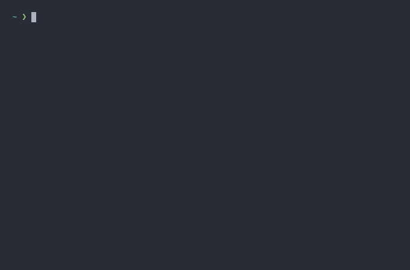

# Foundry Factory

[](https://github.com/ghost-fvtt/foundry-factory/actions)
[](https://www.npmjs.com/package/@ghost-fvtt/foundry-factory)

[](https://ko-fi.com/ghostfvtt)


Foundry Factory is an interactive CLI tool that developers can use to
bootstrap modules and systems for [Foundry Virtual Tabletop]. It allows
developers to choose among different presets to initialize their projects.

It is designed to be extendable so that adding additional presets is quite easy.

[](./img/demo.gif)

## Usage

You can run Foundry Factory with `npx`:

```
npx @ghost-fvtt/foundry-factory <project-directory>
```

Alternatively you can install it globally and then execute it:

```
npm install -g @ghost-fvtt/foundry-factory
foundry-factory <project-directory>
```

### Command Line Options

```
Usage: foundry-factory [options] <project-directory>

Options:
  -v, --version                          Show the version number of Foundry Factory
  -t, --type <type>                      Create a project of this type (choices: "module", "system")
  -p, --preset <preset>                  Use this preset (choices: "ghost-gulp-rollup", "league-js")
  -d, --default                          Use the default preset (default: false)
  -n, --no-config                        Skip the configuration prompts of the selected preset and use its default configuration
  -f, --force                            Overwrite target directory if it exists (default: false)
  --no-deps                              Skip installing project dependencies
  --no-git                               Skip git initialization
  -m, --packageManager <packageManager>  Use the specified npm client when installing dependencies (choices: "npm", "yarn", "yarn2", default: "npm")
  -h, --help                             display help for command
```

## Presets

Here is a list of available presets with links to their individual
documentation:

- [ghost's Gulp + Rollup Preset](./src/presets/ghost-gulp-rollup/README.md)
- [League Basic JS Module Template](https://github.com/League-of-Foundry-Developers/FoundryVTT-Module-Template/blob/master/README.md)

## Development

### Prerequisites

In order to build this project, recent versions of `node` and `npm` are
required. Most likely using `yarn` also works but only `npm` is officially
supported. We recommend using the latest lts version of `node`, which is
`v14.15.5` at the time of writing. If you use `nvm` to manage your `node`
versions, you can simply run

```
nvm install
```

in the project's root directory.

You also need to install the project's dependencies. To do so, run

```
npm install
```

### Building

You can build the project by running

```
npm run build
```

Alternatively, you can run

```
npm run build:watch
```

to watch for changes and automatically build as necessary.

### Running the tests

You can run the tests with the following command:

```
npm test
```

## Contributing

Contributions via pull requests are very welcome. If you find any issues, please
report them in the [issue tracker].

### Creating new presets

Foundry Factory is designed to be easily extendable, so adding new presets
should be pretty straight forward. In order to create a new preset, there are a
couple of things you need to do:
- Add a new folder for your preset in the `src/presets` directory.
- In that folder, create a class which implements the `Preset` interface and has
  the methods of the `PresetConstructor` interface as static methods.
  - The `getProgrammaticFiles` method returns a mapping between files to create
    and the contents (as `string`) to write them.
  - The `getTemplateFiles` method returns a mapping between files to create and
    [Nunjucks] template files used to render them.
  - The `getTemplateVariables` returns a record of additional template variables
    to pass to the Nunjucks templates.
  - The `getAdditionalDirectories` returns a list of additional directories to
    create.
  - The `getDependencies` method returns a list of dependencies to install.
  - The `getDevDependencies` method returns a list of development dependencies
    to install.
  - The `getPostInstallationCommands` method returns a list of shell commands to
    run after the rest of the installation has completed. Make sure that they
    work on both Unix-like systems and Windows.
- If your preset does not need some of these features, simply omit the
  corresponding methods. Except for the static methods, all of them are
  optional.
- Add your preset to the `presets` constant in `src/presets/presets.ts`.
- Optionally, create a folder for your preset in the `template` directory,
  containing any Nunjucks templates you want to render.
  In order to render them, you need to return paths to them (relative to the
  `template` directory) from the `getTemplateFiles` method of your class.

## Licensing

This software project is licensed under the MIT License, a copy of which can be
found under [LICENSE](./LICENSE).

## Acknowledgment

While this is not a fork of [Foundry Project Creator], a lot of inspiration was
taken from it. You could think if it more as a rewrite with a couple of
different design goals.

Credit for the name "Foundry Factory" goes to [BadIdeasBureau].

[Foundry Virtual Tabletop]: https://foundryvtt.com
[Gulp]: https://gulpjs.com/
[Rollup]: https://rollupjs.org/
[issue tracker]: https://github.com/ghost91-/foundry-factory/issues
[Nunjucks]: https://mozilla.github.io/nunjucks/
[Foundry Project Creator]: https://gitlab.com/foundry-projects/foundry-pc/create-foundry-project
[BadIdeasBureau]: https://github.com/BadIdeasBureau
